# Architecture

## Overview

The vibe-checker is deployed as a containerized Next.js application on AWS ECS Fargate, with an Application Load Balancer (ALB) providing public HTTPS access.

We've prioritised simplicity and cost-efficiency in the architecture of the web app. The key components are:

- **S3** acts as a super simple, human readable, and cost-effective data layer. We're not using a 'proper' database here to keep things simple.
- **ECS Fargate** means that we don't need to manage EC2 instances directly.
- **Private subnets** keep our ECS tasks isolated from the public internet, accessible only via the ALB. This is a security best-practice.
- **CloudWatch logs** give us a simple way to monitor the application.

## Simplified System Diagram

```mermaid
graph LR
    User["👤 User<br/>HTTPS"]
    
    subgraph Public["Public Network"]
        ALB["ALB<br/>Port 443"]
    end
    
    subgraph Private["Private Network"]
        ECS["ECS Container<br/>Port 3000"]
    end
    
    S3["S3 Bucket"]
    ECR["ECR<br/>Images"]
    Logs["CloudWatch<br/>Logs"]
    
    User -->|Route53<br/>vibe-checker.labs...| ALB
    ALB -->|TLS<br/>Port 443→3000| ECS
    
    ECS -->|Health Check| ALB
    ECS -->|Read Data| S3
    ECS -->|Pull Image| ECR
    ECS -->|Write Logs| Logs
```

## Idealised request/response flow

1. User visits `https://vibe-checker.labs.climatepolicyradar.org`
2. Route53 DNS resolves to the ALB's IP address
3. ALB forwards request to ECS container on port 3000
4. The task running in the container fetches labelled passages, classifier metadata etc from S3
5. The task returns the response through ALB to the user, rendered nicely by Next.js
